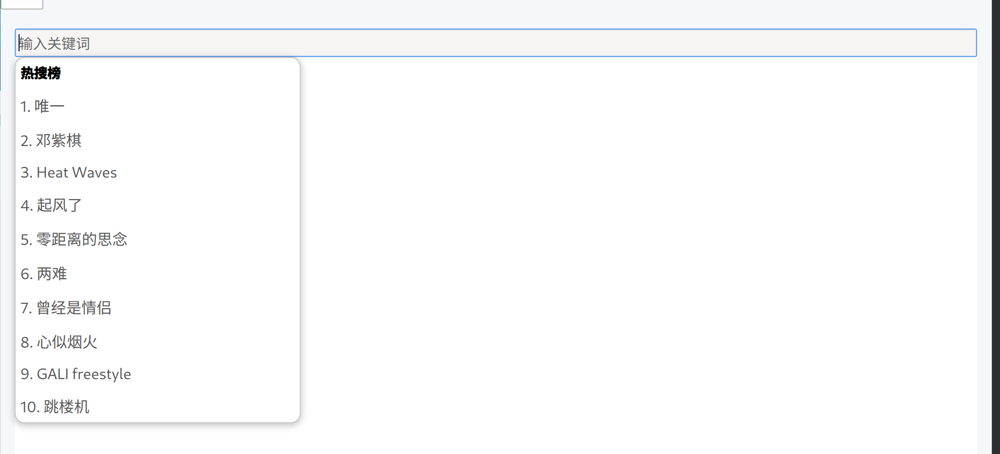
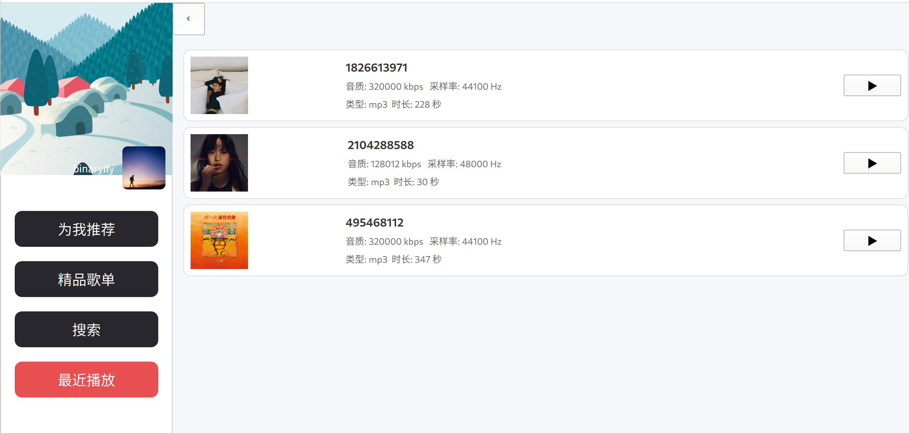
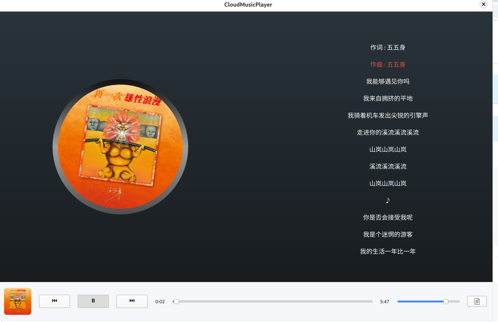
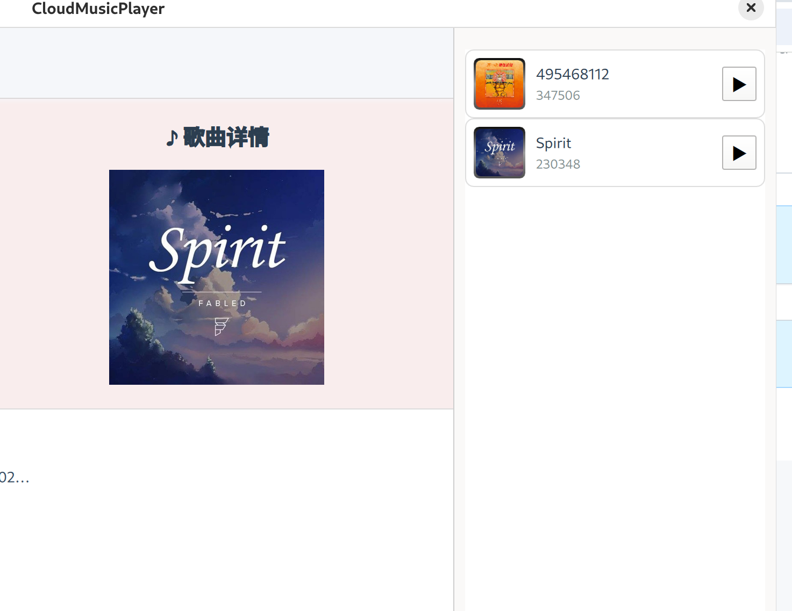
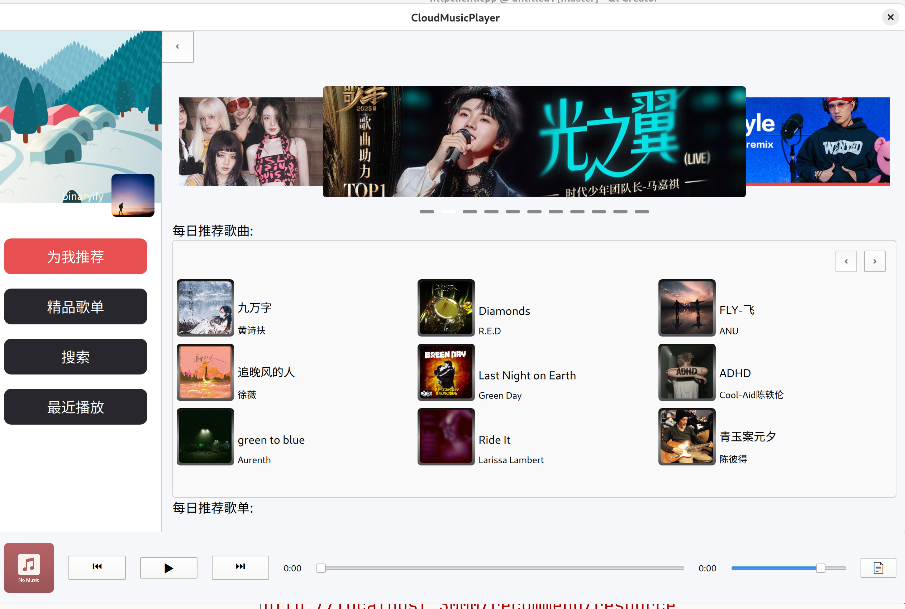
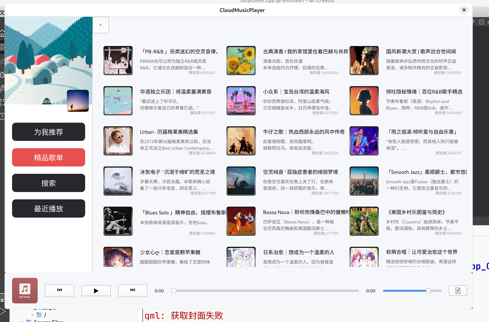

# Qt c++ & Qml 在线音乐播放器
这是一个基于 Qt C++ 与 QML 技术栈开发的在线音乐播放器，使用现代 UI 架构和模块化设计，支持 API 数据交互、异步请求、响应式界面、歌词滚动及播放控制等功能。

# 截屏：

  
  
  
  
  
  
  

# 主要页面组成

推荐页面
- 宣传轮播图
- 每日推荐歌曲
- 每日推荐歌单

歌单页面
- 所有热门歌单
- 歌单详情
- 歌曲详情

搜索页面
- 搜索展示
- 热搜榜
- 歌曲详情

最近播放页面
- 播放记录展示

右侧侧边栏
- 播放队列

底部播放控制栏
- 上一首/下一首/播放/暂停
- 歌曲播放进度条
- 音量调整
- 侧边栏控制
- 沉浸式歌曲播放页面

沉浸式歌曲播放页面
- 滚动歌词
- 旋转封面

# 构建

## 环境要求
Qt6 
CMake
c++11以上
